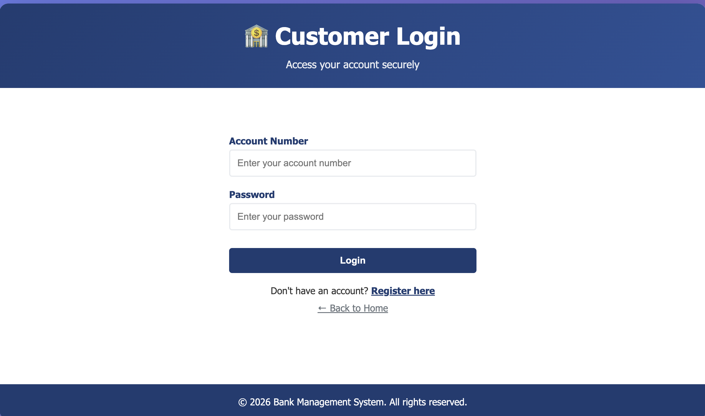
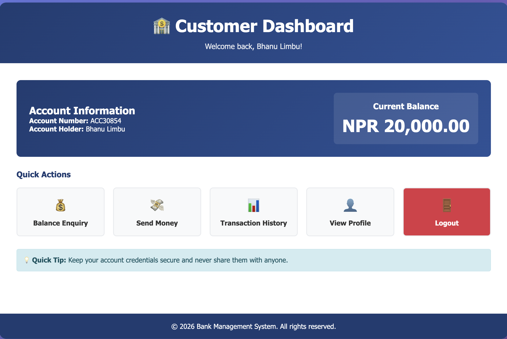

🏦 Bank Management System (Web Application)

A simple and secure web-based Bank Management System built using PHP, MySQL, HTML, CSS, and JavaScript, designed for educational and small-scale banking purposes.

✨ Key Features

👤 User
	•	Account registration & secure login
	•	Balance enquiry
	•	Fund transfer between accounts
	•	Transaction history
	•	Profile viewing

🛠 Admin
	•	Admin dashboard
	•	View all users & transactions
	•	Close user accounts

🧰 Technology Stack
	•	Frontend: HTML5, CSS3, JavaScript
	•	Backend: PHP
	•	Database: MySQL
	•	Server: Apache (XAMPP)

⚙️ Installation (Quick Start)
	1	Install XAMPP and start Apache & MySQL
	2	Copy project folder to htdocs
	3	Create database bank_management_system in phpMyAdmin
	4	Import database.sql
	5	Open browser and visit:👉 http://localhost/bank_management_system/

🔐 Security Highlights
	•	Password hashing
	•	Prepared statements (SQL injection prevention)
	•	Session-based authentication
	•	Input validation
	•	Secure transaction handling

🎓 Purpose

This project demonstrates:
	•	Secure authentication
	•	Database transactions
	•	User & admin role management
	•	PHP–MySQL integration
	•	Web-based banking workflows# bank-management

## 📸 Project Preview

### 🏠 Home Page

### 🔐 Login Page

### 📊 User Dashboard

